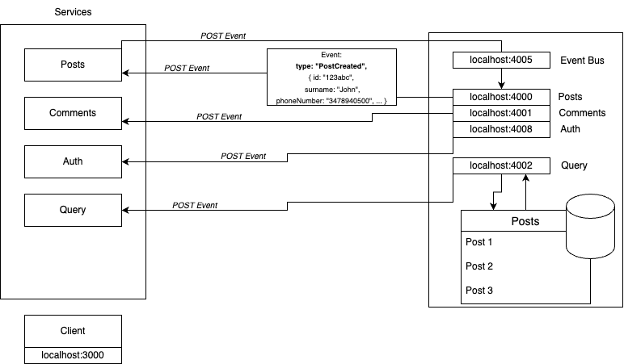

# Social Posts Project Documentation

# System Diagram

## Table of Contents

1. - [Introduction](#introduction)
2. - [Architecture Overview](#architecture-overview)
3. - [Authentication](#authentication)
4. - [Microservices](#microservices)
5. - [Event Bus](#event-bus)
6. - [Queue System](#queue-system)
7. - [Nice To Have](#nice-to-have)

---

## 1. Introduction

This project is a simple Social application allows users to register, login, create posts, and add comments to posts. It utilizes various technologies including React, Node.js, Express, and MongoDB to provide a robust social posts platform.

## 2. Architecture Overview

Our project follows a microservices architecture, where no service depends on another directly. This modular approach ensures scalability and maintainability. Additionally, we use an event bus to handle events, both receiving and processing them efficiently.

## 3. Authentication

### JWT and Cookie-Based Authentication

Our authentication system is based on JSON Web Tokens (JWT) and cookies. When a user logs in, they receive a JWT token that is stored in a cookie. This token is used to authenticate subsequent requests. It enhances security and ensures a seamless user experience.

## 4. Microservices

Our application is divided into several microservices, each responsible for specific functionalities:

- **User Service**: Manages user registration and login.
- **Post Service**: Handles post creation and retrieval.
- **Comment Service**: Allows users to add comments to posts.
- **Event Bus (or Event Broker) Service**: Handles async microservices communication.
- **Query**: Manages query based on event type and handles queue messages.
- **Auth Service**: Handles Authentication logic encrypting decrypting credentials.

This microservices architecture promotes isolation and independent scaling of services.

## 5. Event Bus

### Event Handling with Event Bus

We employ an event bus to manage the communication between microservices. The event bus receives events and dispatches them to the appropriate services. This decoupled communication ensures that services can operate independently and asynchronously.

## 6. Queue System

### Queue System with RabbitMQ

To handle write requests to the database efficiently, a queuing system was implemented using RabbitMQ. Write requests, such as creating a new post or comment, are placed in a queue and processed asynchronously. This enhances the performance and reliability of our application.

## 7. Docker Containerization

### Docker Containerization

Our application is containerized using Docker, allowing for consistent deployment across different environments. Docker containers encapsulate each microservice, simplifying deployment and ensuring compatibility.

## 8. Kubernetes Orchestration

### Kubernetes Orchestration (Nice to Have)

In the future, we plan to implement Kubernetes orchestration for our microservices. Kubernetes provides powerful tools for container orchestration, including automatic scaling, load balancing, and robust management of containerized applications. This will further enhance the scalability and reliability of our platform.

---

This documentation provides an overview of our Social Posts project, highlighting key components such as the microservices architecture, authentication system, event bus, and queue system.
